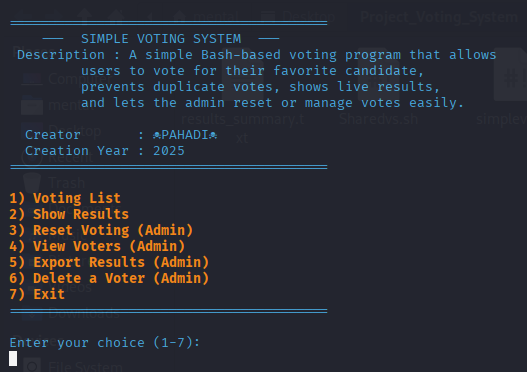

--------

# 🗳️ Simple Voting System (Bash Menu Script)
A clean, beginner-friendly Bash-based voting program that allows users to cast votes for their favorite candidates right from the terminal.
It stores all votes securely in a file, prevents duplicate voting, and provides admin tools for viewing, exporting, or managing votes.

--------
--------

# 📸 Preview


--------
--------

# ✅ Features

🗳️ Vote once per user – prevents duplicate votes  
📄 Stores voter data in voting_data.txt  
🔐 Admin panel with password protection  
👀 View all voters and results anytime  
📤 Export results to a summary file (results_summary.txt)  
❌ Delete or reset votes directly from the script  
🎨 Colorful, menu-based UI for smooth interaction  
⚙️ Works on Linux, Termux, and macOS terminals  

--------
--------

# 🧾 Menu Options

- **1** — Vote for a candidate  
- **2** — Show live voting results  
- **3** — Reset all votes (Admin only)  
- **4** — View all voters (Admin only)  
- **5** — Export results to file (Admin only)  
- **6** — Delete a specific voter (Admin only)  
- **7** — Exit the program
  
--------
--------

# 🚀 Usage : 
### 📱 In Termux  
```bash 
pkg install git -y
git clone https://github.com/mental-pahadi/Unix
cd Unix/Simple-Voting-System
chmod +x VotingSystem.sh
./VotingSystem.sh
```
### 💻 In Linux 
```bash
sudo apt install git -y
git clone https://github.com/mental-pahadi/Unix
cd Unix/Simple-Voting-System
chmod +x VotingSystem.sh
bash VotingSystem.sh
```
### 👀 Default Admin Password 
~~~bash
pahadi01
~~~

--------
--------

# ⚙️ Admin Capabilities

- Reset Voting: Clears all data from the voting file.
- View Voters: Shows who voted for whom.
- Export Results: Saves the current results with timestamps to results_summary.txt.
- Delete a Voter: Remove a single voter’s entry by username.

--------
--------
# 📂 Data Files

| File | Purpose |
|------|----------|
| `voting_data.txt` | Stores all votes and usernames |
| `results_summary.txt` | Stores exported voting results |
---
---

# 🧠 How It Works

1. User enters their username.

2. Script checks if they’ve already voted.

3. If not, they select from 3 candidates:

🧑‍💼 Rohan

👨‍💻 Mohan

🧔 Sohan

4. Votes are saved and counted in real time.

5. Admin can later view, export, or reset votes easily.

---
---

# 💻 Requirements

Works on Linux, macOS, or Termux (Android)

Requires only Bash (no external dependencies)

---
---

# 🧑‍💻 Author

 ☠️ PAHADI ☠️.  
📅 Created in 2025.  
🎓 Ideal for college mini projects and Bash beginners.  

---
---

# ⚠️ Note

If your script doesn’t run on Linux/Termux, convert line endings:
~~~bash
sed -i 's/\r$//' VotingSystem.sh
~~~
or
~~~bash
dos2unix VotingSystem.sh
~~~

---
---

# 🏁 License

This project is open-source and free to use for learning purposes.

---
---

# 💬 Tip

You can modify candidate names, add more options, or even change the admin password directly inside the script.

---


